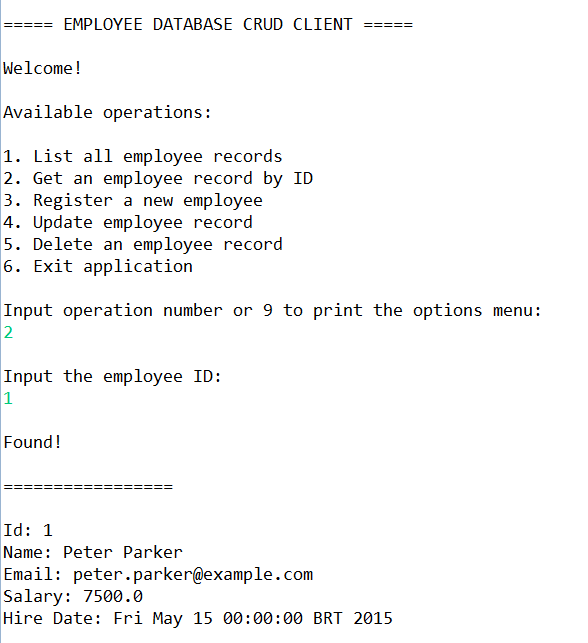

# Company Database Client

This is a small application written in Java for study and practice purposes.

In the context of a company database that holds employee data, the application consists of a client to access and manipulate that data through a text interface.

The RDBMS used in this project is PostgreSQL. The db-setup.sql file in the root directory can be run in the psql application to setup the database and populate it with a few records.

The /lib folder contains the PostgreSQL's Java Database Connectivity Driver (JDBC) used to connect to the database server.

The /src/company folder contain the classes that make up the application. A quick summary of the important classes follows:

- *DatabaseManager*: provides the connection object used to communicate with the database server.
- *Employee*: Java bean that models an employee object.
- *EmployeeDAO*: data access object (DAO) that provides methods to perform create, read, update and delete (CRUD) operations on employee records.
- *UserInterface*: contains methods to provide the interaction with the user through the system's out stream.
- *App*: contains the main method used to start the application.

The /test folder contains test classes for each of the methods of the EmployeeDAO class.

And finally in the /jdbc/study folder there are annotations and example classes written while studying JDBC classes and features.

## Screenshots

